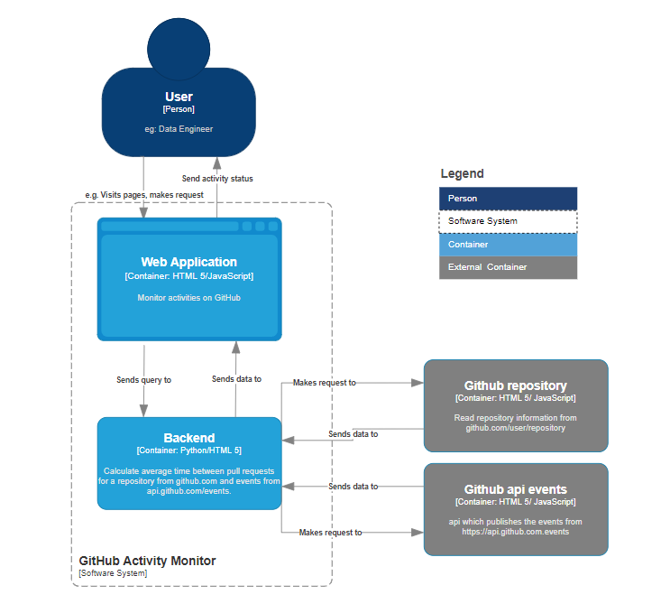

# GitHub Monitor

GitHub monitor can be used to monitor activities on [GitHub](https://github.com/) and [Github API events](https://api.github.com/events).
The average pull requests can be obtained by entering the username and repository from GitHub. 
The events are streamed in python and number of events are counted and published in the web application. 
The project can be accessed by following the Installation instructions.



The c4model in the figure above gives the description of the software system. A user (ex: Data engineer) can access the
web application to monitor events on [GitHub](https://github.com). The user can interact with the web application by entering
the relevant information (ex: offset in minutes). The web application then sends the information to the backend to process 
the information to provide information about average time between pull requests and event counts.

### Given
1. Events from api.github.com/events.
2. Interested events are WatchEvent, PullRequestEvent and IssuesEvent.

### Assumptions
1. The username and github repository are known and the repository is public.
2. Offset time needs to a integer and greater than 0.

### Installation
(Recommended usage: Linux system)
```bash
unzip GitHubmonitor.zip
cd /path/to/GitHubmonitor
python3 -m venv venv
source venv/bin/activate
pip3 install -r requirements.txt
export FLASK_APP=main.py
export FLASK_ENV=development
flask run
```
And then go to http://127.0.0.1:5000/ or the link in terminal to access the GitHub monitor web application.


